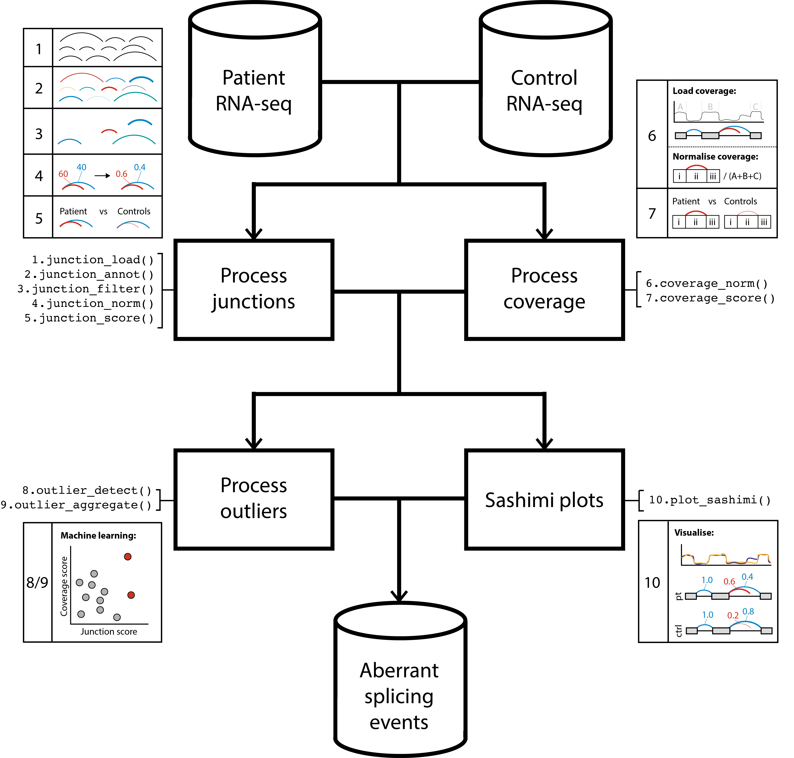

```{r setup, include = FALSE}
knitr::opts_chunk$set(
    collapse = TRUE,
    comment = "#>",
    crop = NULL ## Related to https://stat.ethz.ch/pipermail/bioc-devel/2020-April/016656.html
)
```

```{r vignetteSetup, echo=FALSE, message=FALSE, warning = FALSE}
## Track time spent on making the vignette
startTime <- Sys.time()

## Bib setup
library("RefManageR")

## Write bibliography information
bib <- c(
    R = citation(),
    BiocStyle = citation("BiocStyle")[1],
    knitr = citation("knitr")[1],
    rmarkdown = citation("rmarkdown")[1],
    sessioninfo = citation("sessioninfo")[1],
    testthat = citation("testthat")[1],
    dasper = citation("dasper")[1],
    RefManageR = citation("RefManageR")[1]
)

```

# Basics

## Install `dasper`

`R` is an open-source statistical environment which can be easily modified to enhance its functionality via packages. `r Biocpkg("dasper")` is a `R` package available via the [Bioconductor](http://bioconductor.org) repository for packages. `R` can be installed on any operating system from [CRAN](https://cran.r-project.org/) after which you can install `r Biocpkg("dasper")` by using the following commands in your `R` session:

```{r "install", eval = FALSE}
if (!requireNamespace("BiocManager", quietly = TRUE)) {
    install.packages("BiocManager")
}

BiocManager::install("dzhang32/dasper")

## Check that you have a valid Bioconductor installation
BiocManager::valid()
```

## Required knowledge

The expected input of `r Biocpkg("dasper")` are junctions reads (e.g. directly outputted from an aligner such as [STAR](https://github.com/alexdobin/STAR) or extracted from a BAM file (e.g. using [megadepth](https://github.com/LieberInstitute/megadepth)) and coverage in the form of BigWig files (which can be generated from BAM files using [megadepth](https://github.com/LieberInstitute/megadepth) or [RSeQC](http://rseqc.sourceforge.net/#bam2wig-py)). `r Biocpkg("dasper")` is based on many other packages and in particular in those that have implemented the infrastructure needed for dealing with RNA-sequencing data. The packages `r Biocpkg("SummarizedExperiment")` and `r Biocpkg("GenomicRanges")` are used throughout, therefore familiarity with these packages will greatly help in interpreting the output of `r Biocpkg("dasper")`.

If you are asking yourself the question "Where do I start using Bioconductor?" you might be interested in [this blog post](http://lcolladotor.github.io/2014/10/16/startbioc/#.VkOKbq6rRuU). Or if you find the structure of a `r Biocpkg("SummarizedExperiment")` unclear, you might consider checking out [this manual](http://master.bioconductor.org/help/course-materials/2019/BSS2019/04_Practical_CoreApproachesInBioconductor.html).

## Asking for help

As package developers, we try to explain clearly how to use our packages and in which order to use the functions. But `R` and `Bioconductor` have a steep learning curve so it is critical to learn where to ask for help. The blog post quoted above mentions some but we would like to highlight the [Bioconductor support site](https://support.bioconductor.org/) as the main resource for getting help: remember to use the `dasper` tag and check [the older posts](https://support.bioconductor.org/t/dasper/). Other alternatives are available such as creating GitHub issues and tweeting. However, please note that if you want to receive help you should adhere to the [posting guidelines](http://www.bioconductor.org/help/support/posting-guide/). It is particularly critical that you provide a small reproducible example and your session information so package developers can track down the source of the error.

## Citing `dasper`

We hope that `r Biocpkg("dasper")` will be useful for your research. Please use the following information to cite the package and the overall approach. Thank you!

```{r "citation"}
## Citation info
citation("dasper")
```

# Quick start guide

## Workflow {#workflow}

```{r "dasper workflow", echo = FALSE}

```

The above workflow diagram gives a top-level overview of the available functions within `dasper` and describes the order in which they are intended to be run. This are broadly split into 4 categories:

1.  **Process junctions** functions are prefixed with a *junction\_*. They will load in your junctions into an `RangedSummarizedExperiment` object, annotate your junctions using reference annotation, filter out junctions for those that likely originate from technical noise and normalize your junction counts to allow for comparison between samples.
2.  **Process coverage** functions are prefixed with a *coverage\_*. They annotate your junctions with coverage from associated regions then normalize this coverage to allow for comparison between samples.
3.  **Outlier detection** functions are prefixed with a *outlier\_*. They will use a outlier detection algorithm ([isolation forest](https://scikit-learn.org/stable/modules/generated/sklearn.ensemble.IsolationForest.html)) to detect the most outlier/abnormal/aberrant junctions in terms of their counts and associated coverage.
4.  **Sashimi plots** can be generated using the function `plot_sashimi`. This enables you to select a gene, transcript or region of interest and plot the splicing and coverage across that region in the form of sashimi plot.

## Example

`dasper` includes wrapper functions for the 3 major analysis steps in the workflow - processing junction data, processing coverage data, then performing outlier detection. If you are familiar with `dasper` or uninterested with the intermediates, you can go from start to finish using these wrappers.

### Setup {#setup}

First, we need to install the system dependency [megadepth](https://github.com/ChristopherWilks/megadepth), which is required for the loading of coverage from BigWig files. The easiest way to do this is to run `install_megadepth` from the `r Biocpkg("megadepth")`

```{r "install megadepth"}
megadepth::install_megadepth()
```

`dasper` requires reference annotation that can either be inputted as a `GTF` path or pre-loaded into a `TxDb` object as shown below.

```{r "load ref", warning = FALSE}

# use GenomicState to load txdb (GENCODE v31)
ref <- GenomicState::GenomicStateHub(version = "31", genome = "hg38", filetype = "TxDb")[[1]]
```

RNA-seq data in the form of junctions and BigWig files are the required raw input to `dasper`. For illustration, in this vignette we will use an BigWig file from the GTEx v6 data publicly hosted by [recount2](https://jhubiostatistics.shinyapps.io/recount/). In reality, users should use the BigWig files that correspond to the same samples as those your junction data originate from.

```{r "DL bws"}

# Obtain the urls to the remotely hosted GTEx BigWig files
url <- recount::download_study(
    project = "SRP012682",
    type = "samples",
    download = FALSE
)

# cache the file using BiocFileCache for faster retrieval
bw_path <- dasper:::.file_cache(url[1])
```

A small set of example junctions are included within the package, which can be used for testing the functionality of `dasper`.

```{r "junctions_example"}
library(dasper)

junctions_example
```

### Running `dasper`

Here, we run the 3 wrapper functions (`junction_process`, `coverage_process` and `outlier_process`) on `junctions_example`. These functions are designed to be compatible with usage of the `%>%` pipe from [tidyverse](https://www.tidyverse.org/). The time-limiting steps of this analysis can be run parallel using `r Biocpkg("BiocParallel")` as shown.

```{r "dasper quick start", eval = FALSE}

library(magrittr)

outlier_scores <-
    junction_process(junctions_example, ref) %>%
    coverage_process(ref,
        coverage_paths_case = rep(bw_path, 2),
        coverage_paths_control = rep(bw_path, 3),
        bp_param = BiocParallel::MulticoreParam(5)
    ) %>%
    outlier_process(bp_param = BiocParallel::MulticoreParam(5))
```

# Comprehensive usage guide

In this section, we will run each of the 1-9 functions shown in [workflow](#workflow). This can be helpful for users that want to understand or modify the intermediates of the `dasper` pipeline or are only interested in a executing a specific step (e.g. annotating junctions using `junction_annot`). If you want to follow along and run this code in your R session, make sure you have followed the instructions in the section [setup](#setup).

## Junction processing

The first step is to load in patient (and control) junction data using `junction_load`. By default, this expects junction files in the format outputted by the [STAR](https://github.com/alexdobin/STAR) aligner (SJ.out). If the user's junctions are in a different format you can accommodate for this by adjusting the `load_func` argument. The output of this will be junctions stored in a `RangedSummarizedExperiment` object required for the downstream `dasper` functions.

Additionally, users can choose to add a set of control junctions from GTEx v6 (publicly available through [recount2](https://jhubiostatistics.shinyapps.io/recount/)) using the argument `controls`. This may be useful if the user only has RNA-seq data from only a single or small number of patients, which is often the case in a diagnostic setting. In this example, we arbitrarily chose to use the GTEx junctions from the fibroblast tissue. However, we would recommend matching the control tissue to the tissue from which your patient RNA-seq data was derived. The current available tissues that be selected via `controls` are "fibroblasts", "lymphocytes", "skeletal\_muscle" and "whole\_blood".

```{r "junction_load"}

junctions_example_1_path <-
    system.file(
        "extdata",
        "junctions_example_1.txt",
        package = "dasper",
        mustWork = TRUE
    )
junctions_example_2_path <-
    system.file(
        "extdata",
        "junctions_example_2.txt",
        package = "dasper",
        mustWork = TRUE
    )

# only keep chromosomes 21 + 22 for speed
junctions <-
    junction_load(
        junction_paths = c(
            junctions_example_1_path,
            junctions_example_2_path
        ),
        controls = "fibroblasts",
        chrs = c("chr21", "chr22")
    )

junctions
```

Next, we will annotate our junctions using `junction_annot`. Using reference annotation inputted via `ref`, this will classify junctions into the categories "annotated", "novel\_acceptor", "novel\_donor", "novel\_combo", "novel\_exon\_skip", "ambig\_gene" and "unannotated". Additionally, the genes/transcripts/exons that each junction overlaps will be stored in the `SummarizedExperiment::rowData`. This information is necessary for the downstream `dasper` functions but can also be useful independently if user's are interested in for example, only retrieving the annotated/unannotated junctions.

```{r "junction_annot"}

# take only the first 5 samples (2 cases, 3 controls)
# to increase the speed of the vignette
junctions <- junctions[, 1:5]

junctions <- junction_annot(junctions, ref)

head(SummarizedExperiment::rowData(junctions))
```

We will then filter our junctions using `junction_filter`. You have the option of choosing to filter by count, width, type (annotation category) and whether junctions overlap a particular genomic region. The default settings shown below filter only by count and require a junction to have at least 5 reads in at least 1 sample to be kept in.

```{r "junction_filter"}

junctions <- junction_filter(junctions,
    count_thresh = c(raw = 5),
    n_samp = c(raw = 1)
)

junctions
```

We can then normalize our raw junctions counts into a proportion-spliced-in using `junction_norm`. This will first cluster each junction by finding all other junctions that share an acceptor or donor site with it. Then, calculate the normalized counts by dividing the number of reads supporting each junction with the total number of reads in it's associated cluster.

```{r "junction_norm"}

junctions <- junction_norm(junctions)

# save a separate object for plotting
junctions_normed <- junctions

# show the raw counts
tail(SummarizedExperiment::assays(junctions)[["raw"]])

# and those after normalisation
tail(SummarizedExperiment::assays(junctions)[["norm"]])
```

Finally, we need to score each patient junction by how much it's (normalized) counts deviate from the count distribution of the same junction in the control samples using `junction_score`. By default, this uses a z-score measure, however this can be modified to a user-inputted function by adjusting the argument `score_func`. These junction scores with be stored in the `SummarizedExperiment::assays` "score".

```{r "junction_score"}
junctions <- junction_score(junctions)

names(SummarizedExperiment::assays(junctions))
```

## Coverage processing

We then move on to loading and normalising the coverage across regions associated with each junction using `coverage_norm`. Namely, these are the 2 exonic regions flanking each junction and the intron inbetween. Given that there are 3 regions for each junction and we need to obtain coverage for every junction from every sample, this step can be very computationally intense to run. Here, `dasper` allows parrallelisation across samples using `r Biocpkg("BiocParallel")` and uses the tool [megadepth](https://github.com/ChristopherWilks/megadepth) developed by [Chris Wilks](https://github.com/ChristopherWilks), which is significantly faster than other tools (`rtracklayer` and `pyBigWig`) for loading coverage from BigWig files (see [runtime comparison](https://github.com/LieberInstitute/megadepth/blob/master/analysis/test_megadepth_pyBigWig_rtracklayer.Rmd)).

```{r "coverage_norm"}
coverage <- coverage_norm(
    junctions,
    ref,
    coverage_paths_case = rep(bw_path, 2),
    coverage_paths_control = rep(bw_path, 3),
    bp_param = BiocParallel::SerialParam()
)
```

`coverage_score` can then be used to compare the coverage associated with each junction to the coverage distribution corresponding to the same region in controls. After which, junctions should have the `SummarizedExperiment::assays` "coverage\_score".

```{r, "coverage_score"}
junctions <- coverage_score(junctions, coverage)

names(SummarizedExperiment::assays(junctions))
```

## Outlier processing

The last step in the `dasper` pipeline is to use the "scores" and "coverage scores" as input into an outlier detection model. This involves using `outlier_detect` to score each junction in each sample by how aberrant it looks. The outputted scores will be stored in the `SummarizedExperiment::assays` "outlier\_score". This step can be can be parallelised using `r Biocpkg("BiocParallel")`. The fit of the `isolation forest` may fluctuate depending on it's intial `random_state`. For reproducibility you can avoid this by setting the parameter `random_state` to an fixed integer (for more details on the isolation forest model see <https://scikit-learn.org/stable/modules/generated/sklearn.ensemble.IsolationForest.html>).

```{r, "outlier_detect"}
junctions <- outlier_detect(
    junctions,
    bp_param = BiocParallel::SerialParam(),
    random_state = 32L
)

names(SummarizedExperiment::assays(junctions))
```

Finally, `outlier_aggregate` will aggregate the junction-level "outlier\_scores" to a cluster level. The returned `outlier_scores` object contains a `DataFrame` with each row detailing a cluster in terms of how aberrant it looks. The `gene_id_cluster` column describes the gene linked to each cluster, derived from the gene annotation returned by `junction_annot`. Splicing events are ranked in the `rank` column with 1 referring to the most aberrant splicing event in that patient. Details of the specific junctions that look the most aberrant for each cluster can be found in the `junctions` column.

```{r, "outlier_aggregate"}
outlier_scores <- outlier_aggregate(junctions, samp_id_col = "samp_id", )

head(outlier_scores)
```

## Sashimi plots

In order to help further inspection of the candidate genes with abberrant splicing returned by `dasper`, we also include functions to visualise splicing across genes/transcripts/regions of interest. For example, you could visualise the gene with the most aberrant cluster in `samp_1`.

```{r, "sashimi_1"}

# take gene_id of the cluster ranked 1
gene_id <- unlist(outlier_scores[["gene_id_cluster"]][1])

plot_sashimi(
    junctions_normed,
    ref,
    case_id = list(samp_id = "samp_1"),
    gene_tx_id = gene_id,
    count_label = FALSE
)
```

Often regions of splicing can be very complex within a gene/transcript. In which case, you may consider zooming in on a specific region of interest using the argument `region`. Furthermore, the thickness of the lines represents the normalized counts of each junction however in this way, it can be difficult to accurately differentiate junctions that have similar counts. Users may want to add a label representing the count of each junction using the argument `count_label`.

```{r, "sashimi_2"}
plot_sashimi(junctions_normed,
    ref,
    case_id = list(samp_id = "samp_1"),
    gene_tx_id = gene_id,
    region = GenomicRanges::GRanges("chr22:42620000-42630000"),
    count_label = TRUE
)
```

# Reproducibility

The `r Biocpkg("dasper")` package `r Citep(bib[["dasper"]])` was made possible thanks to:

-   R `r Citep(bib[["R"]])`
-   `r Biocpkg("BiocStyle")` `r Citep(bib[["BiocStyle"]])`
-   `r CRANpkg("RefManageR")` `r Citep(bib[["RefManageR"]])`
-   `r CRANpkg("knitr")` `r Citep(bib[["knitr"]])`
-   `r CRANpkg("rmarkdown")` `r Citep(bib[["rmarkdown"]])`
-   `r CRANpkg("sessioninfo")` `r Citep(bib[["sessioninfo"]])`
-   `r CRANpkg("testthat")` `r Citep(bib[["testthat"]])`

This package was developed using `r BiocStyle::Biocpkg("biocthis")`.

Code for creating the vignette

```{r createVignette, eval=FALSE}
## Create the vignette
library("rmarkdown")
system.time(render("dasper.Rmd", "BiocStyle::html_document"))

## Extract the R code
library("knitr")
knit("dasper.Rmd", tangle = TRUE)
```

Date the vignette was generated.

```{r reproduce1, echo=FALSE}
## Date the vignette was generated
Sys.time()
```

Wallclock time spent generating the vignette.

```{r reproduce2, echo=FALSE}
## Processing time in seconds
totalTime <- diff(c(startTime, Sys.time()))
round(totalTime, digits = 3)
```

`R` session information.

```{r reproduce3, echo=FALSE}
## Session info
library("sessioninfo")
options(width = 120)
session_info()
```

# Bibliography

This vignette was generated using `r Biocpkg("BiocStyle")` `r Citep(bib[["BiocStyle"]])` with `r CRANpkg("knitr")` `r Citep(bib[["knitr"]])` and `r CRANpkg("rmarkdown")` `r Citep(bib[["rmarkdown"]])` running behind the scenes.

Citations made with `r CRANpkg("RefManageR")` `r Citep(bib[["RefManageR"]])`.

```{r vignetteBiblio, results = "asis", echo = FALSE, warning = FALSE, message = FALSE}
## Print bibliography
PrintBibliography(bib, .opts = list(hyperlink = "to.doc", style = "html"))
```
